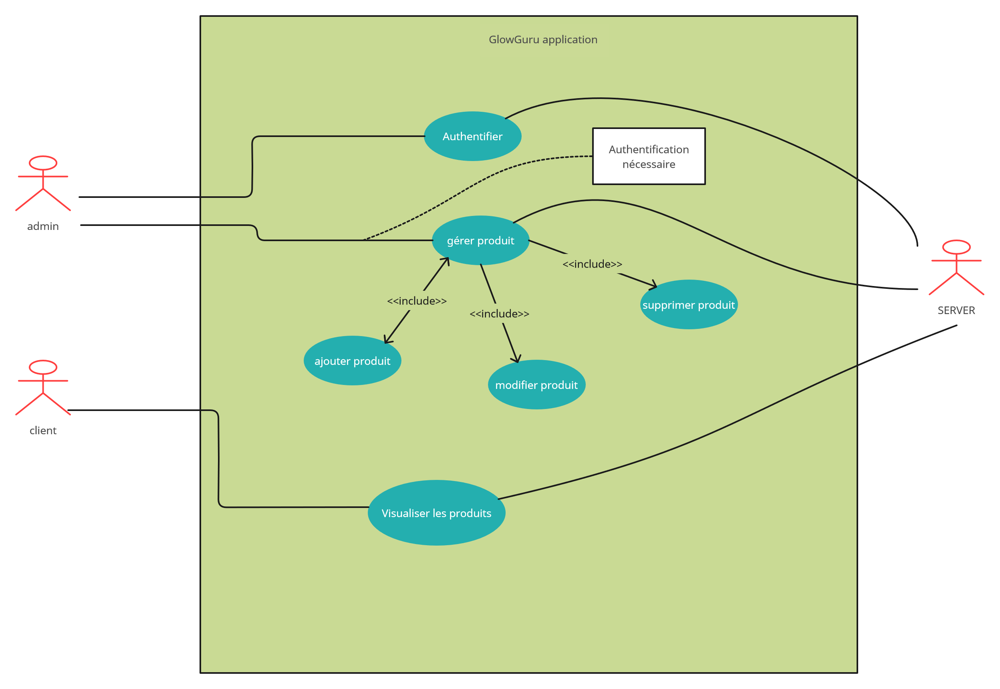
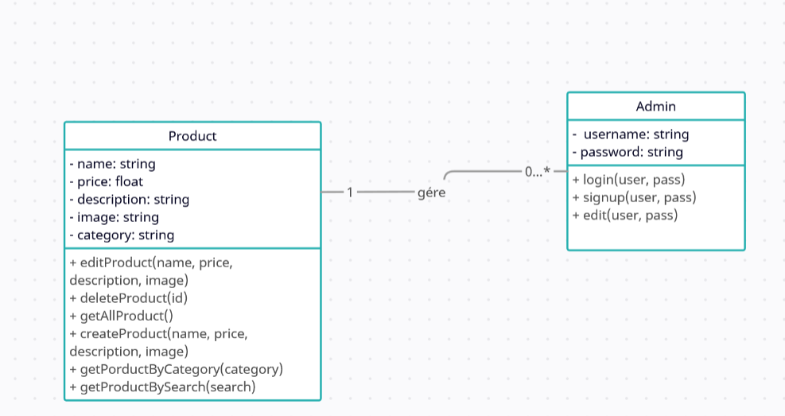

# glowguru comsetic web store

## stack used
 - frontend:
    - tailwind for css
    - vanilla js and html
 - backend:
    - php using mvc
    - mysql with pdo orm
    - docker for devops

## diagrams

- use case diagram:

- class diagram:

## ui inspiration:

https://dribbble.com/shots/20330210-Cosmetic-are
https://dribbble.com/shots/20030117-Product-page-design-for-Cosmo